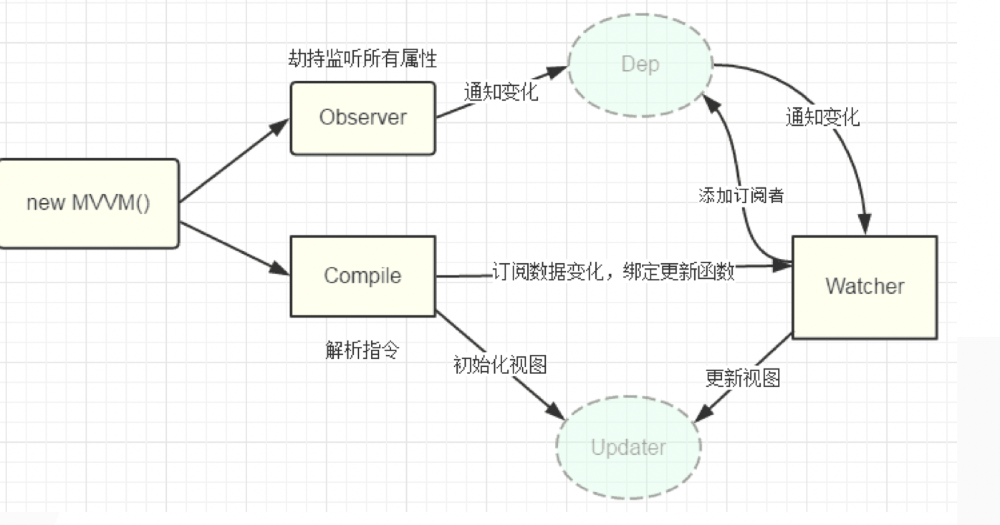
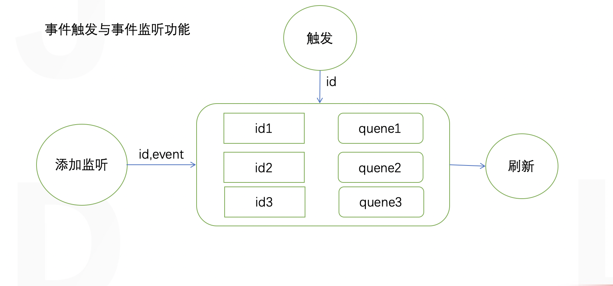

### vue源码思想
#### 劫持属性 实现数据更新

#### 事件监听更新

+ vm上可以访问data的数据 需要一个代理 把data里的key代理到vm上 就需要劫持 使用Object.defineProperty的set和get方法
+ 数据渲染的时候会看是什么指令 分别执行什么方法
+ 双向数据绑定就是执行了v-model指令，执行了其对应的内部方法，先给data赋值，再执行set方法，渲染页面
+ 数组的劫持，执行了 数组的方法 在observe事件代理

